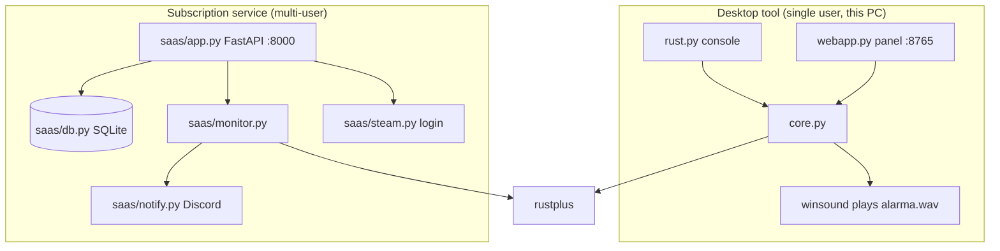

# Architecture

Two products in the same repo. **They share nothing but the [[rustplus]] library.** A change in one must not touch the other.

## Desktop tool

See [[Desktop tool]]. Single user, plays sound on the PC via `winsound`. `core.py` holds all the logic with no import side effects; `webapp.py` is a local `http.server` panel; `rust.py` is the console version.

## Subscription service

See [[Subscription service]]. Multi-user, hosted. [[Steam OpenID]] login, one alarm config per user in SQLite, **one asyncio coroutine per alarm**, alerts via [[Discord Webhooks]].

> [!warning] Single process, single worker
> The monitor state (the `manager` and its runners) lives **in the process memory**. With multiple workers each one would open every alarm → duplicate Rust+ connections and repeated Discord alerts. That is why it runs single-worker (`python -m saas`). Detail in [[VPS deployment]].

## Integers beyond JavaScript's safe range

`STEAM_ID` (~7.6·10¹⁶) exceeds `Number.MAX_SAFE_INTEGER` (9·10¹⁵). It travels to the browser as a **string** and is parsed back to `int` on the server. This holds for both products:

- Desktop: `config_for_client()` / `validate_config` in `core.py`.
- SaaS: `alarm_to_client()` in `saas/app.py` / `validate_alarm` in `saas/db.py`.

HTML inputs are `type="text"`. Sending them as raw JSON numbers corrupts the value. See also [[Security review]].

## Library gotchas

All documented in [[rustplus]]: `connect()` returns `False` (does not raise), `get_entity_info()` returns a `RustError` (does not raise), and it adds a log handler on every `RustSocket()`.
