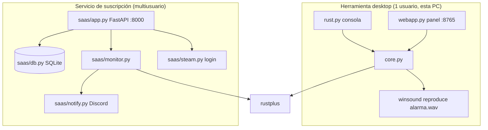

# Arquitectura

Dos productos en el mismo repo. **No comparten nada salvo la librería [[rustplus]].** Un cambio en uno no debe tocar el otro.

## Herramienta desktop

Ver [[Herramienta desktop]]. Un solo usuario, suena en la PC vía `winsound`. `core.py` tiene toda la lógica sin efectos al importar; `webapp.py` es un panel local con `http.server`; `rust.py` es la versión consola.

## Servicio de suscripción

Ver [[Servicio de suscripción]]. Multiusuario, hosteado. Login con [[Steam OpenID]], una config de alarma por usuario en SQLite, **una corrutina asyncio por alarma**, aviso por [[Discord Webhooks]].

> [!warning] Un solo proceso, un solo worker
> El estado del monitor (el `manager` y sus runners) vive **en memoria del proceso**. Con varios workers, cada uno abriría todas las alarmas → conexiones duplicadas a Rust+ y avisos de Discord repetidos. Por eso corre single-worker (`python -m saas`). Detalle en [[Deploy en VPS]].

## Datos que exceden el entero seguro de JavaScript

`STEAM_ID` (~7.6·10¹⁶) supera `Number.MAX_SAFE_INTEGER` (9·10¹⁵). Viaja al navegador como **string** y se reparsea a `int` en el servidor. Vale para ambos productos:

- Desktop: `config_for_client()` / `validate_config` en `core.py`.
- SaaS: `alarm_to_client()` en `saas/app.py` / `validate_alarm` en `saas/db.py`.

Los inputs HTML son `type="text"`. Mandarlos como número JSON crudo corrompe el valor. Ver también [[Seguridad y revisión]].

## Trampas de la librería

Todas documentadas en [[rustplus]]: `connect()` devuelve `False` (no lanza), `get_entity_info()` devuelve `RustError` (no lanza), y agrega un handler de log en cada `RustSocket()`.
