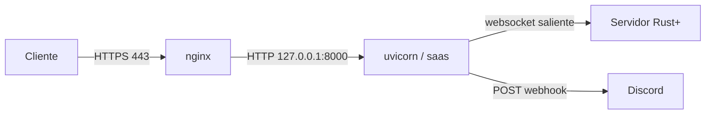

# Deploy en VPS

Ubuntu + [[nginx y systemd|nginx]] como reverse proxy para el dominio, HTTPS con Let's Encrypt. Guía ejecutable completa en `deploy/DEPLOY.md` del repo; esta nota es el mapa conceptual.

## Piezas en `deploy/`

- `rustyalarm.service` — unit de [[nginx y systemd|systemd]]. Arranca `python -m saas`, `Restart=always`, endurecido (`ProtectSystem`, `NoNewPrivileges`).
- `nginx.conf` — server block que proxifica a `127.0.0.1:8000`; certbot le agrega el 443.
- `DEPLOY.md` — paso a paso: deploy key, venv, `.env`, systemd, nginx, certbot.

## Lo que importa

> [!danger] Un solo worker
> El monitor guarda estado en memoria (ver [[Arquitectura]]). Nunca gunicorn multi-proceso ni `--workers >1`: duplicaría conexiones a Rust+ y avisos de Discord.

> [!warning] `RUSTALARM_BASE_URL` = el dominio HTTPS exacto
> De ahí salen el retorno del login de [[Steam OpenID]], el `Secure` de las cookies y el chequeo anti-CSRF. Si no coincide con el dominio real, el login falla.

> [!note] uvicorn bindea a 127.0.0.1
> nginx expone al mundo; uvicorn escucha solo local. `RUSTALARM_HOST=127.0.0.1`, nunca `0.0.0.0`. `saas/__main__.py` pasa `proxy_headers=True` + `forwarded_allow_ips` para confiar en los `X-Forwarded-*` de nginx.

## Variables de entorno

`RUSTALARM_BASE_URL`, `RUSTALARM_HOST`, `RUSTALARM_PORT`, `RUSTALARM_ADMIN_STEAM_ID`, `RUSTALARM_MAX_ALARMS`. Plantilla en `.env.example`. Las lee `saas/config.py`.

## Operación

- Logs: `journalctl -u rustyalarm -f`
- Backup base: `sqlite3 saas_data/rustalarm.db ".backup copia.db"`
- Update: `git pull && pip install -r requirements.txt && systemctl restart rustyalarm`

## Fuentes

- [Certbot (Let's Encrypt) — instrucciones nginx](https://certbot.eff.org/instructions)
- [Uvicorn — deployment](https://www.uvicorn.org/deployment/)
- Ver también [[nginx y systemd]]
