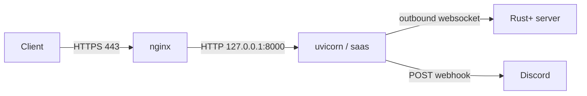

# VPS deployment

Ubuntu + [[nginx and systemd|nginx]] as a reverse proxy for the domain, HTTPS via Let's Encrypt. The full runnable guide is `deploy/DEPLOY.md` in the repo; this note is the conceptual map.

## Pieces in `deploy/`

- `rustyalarm.service` — [[nginx and systemd|systemd]] unit. Runs `python -m saas`, `Restart=always`, hardened (`ProtectSystem`, `NoNewPrivileges`).
- `nginx.conf` — server block that proxies to `127.0.0.1:8000`; certbot adds the 443 block.
- `DEPLOY.md` — step by step: deploy key, venv, `.env`, systemd, nginx, certbot.

## What matters

> [!danger] Single worker
> The monitor keeps state in memory (see [[Architecture]]). Never gunicorn multi-process nor `--workers >1`: it would duplicate Rust+ connections and Discord alerts.

> [!warning] `RUSTALARM_BASE_URL` = the exact HTTPS domain
> The [[Steam OpenID]] login return, the `Secure` cookie flag and the anti-CSRF check all derive from it. If it does not match the real domain, login fails.

> [!note] uvicorn binds to 127.0.0.1
> nginx exposes it to the world; uvicorn listens locally only. `RUSTALARM_HOST=127.0.0.1`, never `0.0.0.0`. `saas/__main__.py` passes `proxy_headers=True` + `forwarded_allow_ips` to trust nginx's `X-Forwarded-*`.

## Environment variables

`RUSTALARM_BASE_URL`, `RUSTALARM_HOST`, `RUSTALARM_PORT`, `RUSTALARM_ADMIN_STEAM_ID`, `RUSTALARM_MAX_ALARMS`. Template in `.env.example`. Read by `saas/config.py`.

## Operations

- Logs: `journalctl -u rustyalarm -f`
- DB backup: `sqlite3 saas_data/rustalarm.db ".backup copy.db"`
- Update: `git pull && pip install -r requirements.txt && systemctl restart rustyalarm`

## Sources

- [Certbot (Let's Encrypt) — nginx instructions](https://certbot.eff.org/instructions)
- [Uvicorn — deployment](https://www.uvicorn.org/deployment/)
- See also [[nginx and systemd]]
